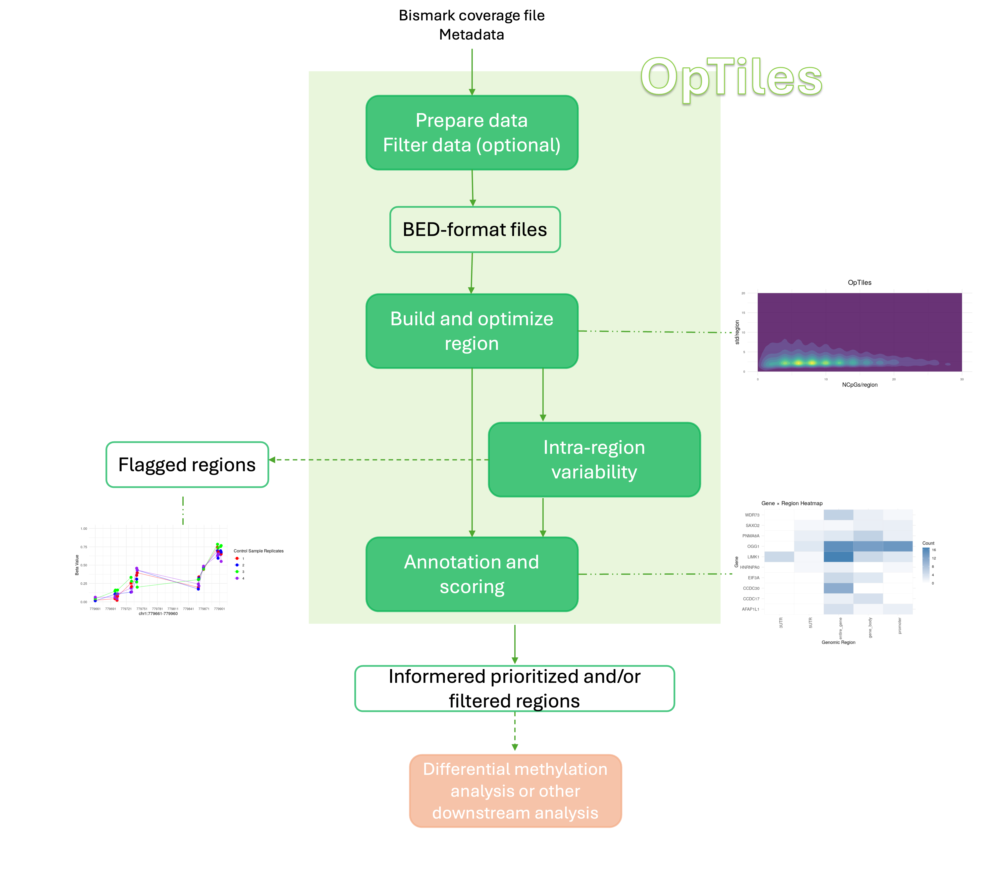

# OpTiles: An R Package for Adaptive Tiling and Methylation Variability Profiling

OpTiles, an R package that dynamically defines tiling windows based on the distribution of sequenced CpGs. OpTiles further quantifies intra-region methylation variability and integrates it with CpG density to generate a metric for region reliability and biological interpretability. The package also includes functions for annotating genomic regions and to quantify overlaps with regions of interest. While compatible with existing tools such as methylKit, OpTiles extends functionality by refining region definitions, supporting data-driven prioritization, and enhancing the interpretation of heterogeneous or complex datasets.



The package implements the methods and algorithms described in the following scientific publication:

> **G. Migliaccio** (2025). *OpTiles: An R Package for Adaptive Tiling and Methylation Variability Profiling*. bioRxiv BIORXIV/2025/674166, DOI: [].

If you use this package in your research, please cite the paper using the citation provided.

## Installation
R version >4.4.1

To install OpTiles, and download the packages you can
1) Clone the repository and restore the same environment used during development

```
git clone https://github.com/fhaive/OpTiles.git
cd OpTiles

R
renv::restore()
devtools::install(".")

```
2) If you prefer to install the package directly (without cloning), please ensure that the required dependencies are installed first.
Some dependencies are available only through Bioconductor or GitHub.

```
# 1. Install BiocManager if not already installed
if (!requireNamespace("BiocManager", quietly = TRUE))
  install.packages("BiocManager")

# 2. Install Bioconductor dependencies
BiocManager::install(c(
  "GenomicRanges", "IRanges", "biomaRt",
  "genomation", "limma", "methylKit"
), ask = FALSE, update = FALSE)

# 3. Install easyGgplot2 from GitHub
if (!requireNamespace("devtools", quietly = TRUE))
  install.packages("devtools")
devtools::install_github("kassambara/easyGgplot2")

# 4. Finally, install OpTiles
if (!requireNamespace("devtools", quietly = TRUE))
  install.packages("devtools")
devtools::install_github("fhaive/OpTiles", build = F, type = "source")
```
If you encounter missing-package errors, make sure both BiocManager and devtools are updated.

## Example script and manual
The script `how_to_use/OpTiles_example_script.R` contains the steps to reproduce the analysis described in the manual `OpTiles_manual.html`.
All the input data used and the outputs produced are available on [Zenodo] https://doi.org/10.5281/zenodo.16961293 .
